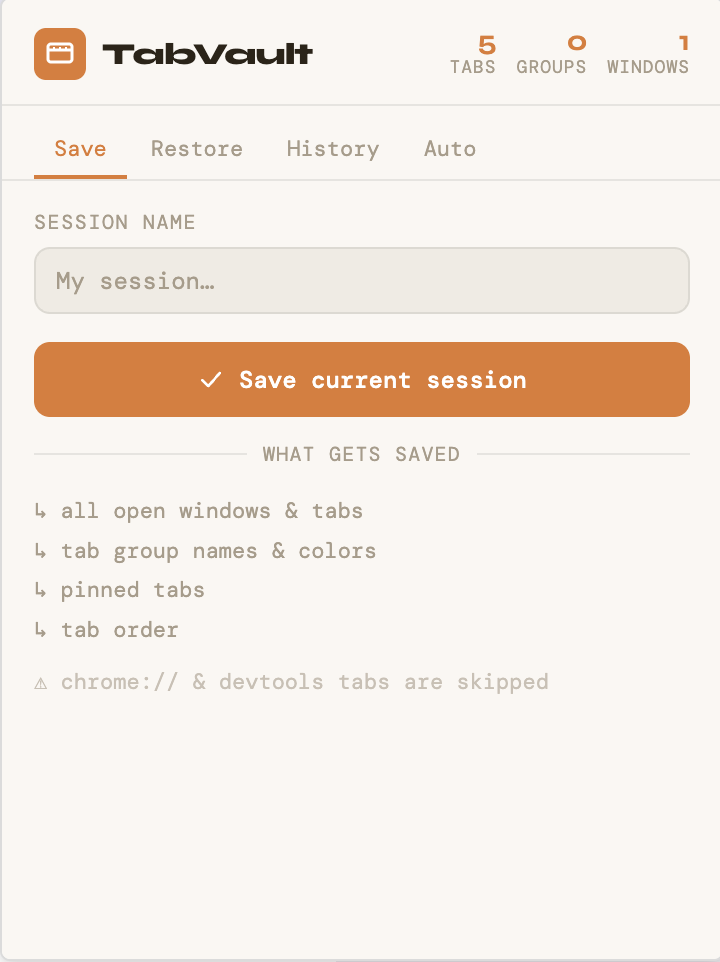

# TabVault — Chrome Extension

Save all your tabs and tab groups to a JSON file. Restore them anytime.



## Features

- **Save** all open windows, tabs, and tab groups (with colors, names, collapsed state)
- **Restore** from any saved `.json` file — into a new window or existing window
- **Auto-save** on a timer (5m, 10m, 15m, 30m, 1h) — saves to local history only, no file downloads
- **History** panel shows your last 20 sessions saved via the extension
- Preserves pinned tabs, active tab, and tab order
- Skips unrestorable URLs (`chrome://`, `devtools://`, etc.)
- Warns before opening 40+ tabs at once
- Handles storage quota by automatically pruning oldest sessions

## Installation

1. Open Chrome and navigate to `chrome://extensions`
2. Enable **Developer mode** (toggle in the top-right corner)
3. Click **Load unpacked**
4. Select the `tabvault` folder
5. The TabVault icon will appear in your Chrome toolbar

> If you don't see the icon, click the puzzle piece (Extensions) menu and pin TabVault.

## Usage

### Saving a session
1. Click the TabVault icon
2. Optionally type a name for the session
3. Click **Save current session**
4. A `.json` file will download automatically

### Restoring a session
1. Click the TabVault icon
2. Go to the **Restore** tab
3. Drop your `.json` file onto the upload zone, or click to browse
4. Choose **New window** (opens in a fresh window) or **This window** (opens in current)

### History
Sessions you save via the extension are also stored locally (last 20). Go to the **History** tab to restore into a new window or re-download as a `.json` file.

### Auto-save
1. Click the TabVault icon
2. Go to the **Auto** tab
3. Toggle **Enabled** on
4. Choose an interval (5m, 10m, 15m, 30m, 1h)
5. Sessions are saved to local history only — no files are downloaded
6. Click **Test auto-save now** to verify it works

> Auto-save requires Chrome to be running for alarms to fire. Auto-saved sessions appear in the History tab.

## File format

```json
{
  "schemaVersion": "1.0",
  "name": "My session",
  "savedAt": "2024-01-15T10:30:00.000Z",
  "windows": [
    {
      "focused": true,
      "state": "maximized",
      "tabs": [
        {
          "url": "https://example.com",
          "title": "Example",
          "pinned": false,
          "groupId": 12,
          "active": false,
          "index": 0
        }
      ],
      "groups": [
        {
          "savedGroupId": 12,
          "title": "Work",
          "color": "blue",
          "collapsed": false
        }
      ]
    }
  ]
}
```

## License

[MIT](LICENSE)

## Permissions used

| Permission | Why |
|---|---|
| `tabs` | Read URLs, titles, pinned state |
| `tabGroups` | Read/write group names and colors |
| `windows` | Create new windows on restore |
| `downloads` | Save the `.json` file to disk |
| `storage` | Keep session history and auto-save config locally |
| `alarms` | Schedule auto-save on a timer |
| `unlimitedStorage` | Avoid 5MB quota for session history |
